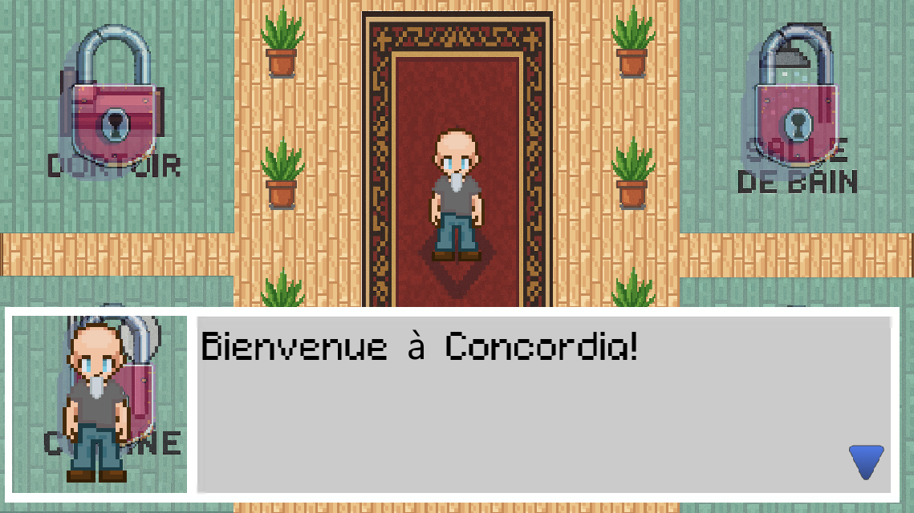
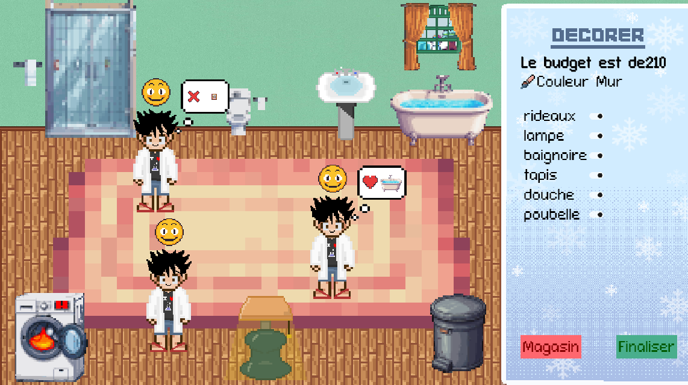
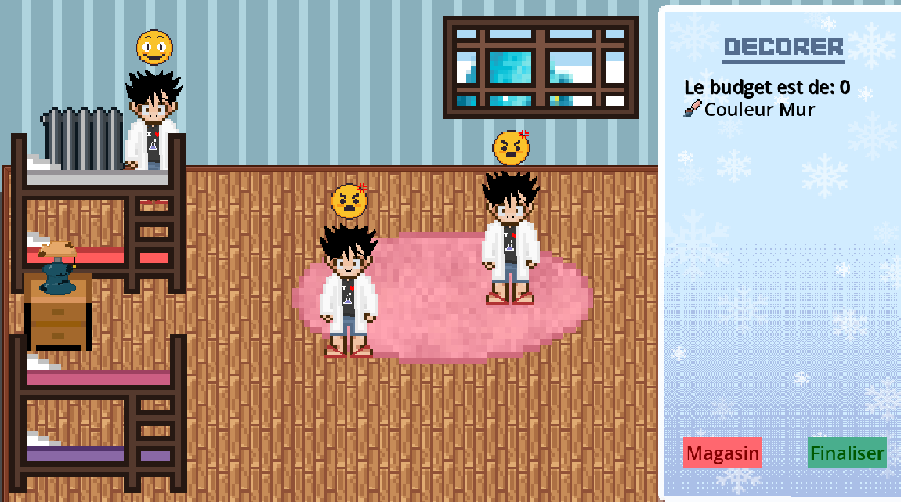

# Archi Pole Sud 

Pour notre projet T3 (en 2e année de BUT Informatique), nous avons développé un **jeu sérieux** intitulé **ArchiPoleSud**.  
Un jeu sérieux en **2D** où le joueur incarne un architecte chargé de rénover la **station polaire Concordia**. Il doit concevoir des espaces adaptés à un **environnement extrême, confiné et multinational** (français, italien etc.).

 
   

### [Installation](./readme/INSTALL.md) &nbsp;&nbsp;&nbsp;&nbsp;&nbsp; [Description](./readme/DESCRIPTION.md)

## Technologies utilisées
- **Godot Engine 4.3**
- **GDScript**
- **Pixel Art** pour les sprites et interfaces
- **GitHub/GitLab** pour la gestion de tâches et le développement collaboratif (projet en miroir)

## Images du jeu 

 
  
  
   

## Auteurs
Projet réalisé dans le cadre du BUT Informatique (2e année, T3).  

- **Bennounas Fella** – Développement, Graphismes  
- **Meral Elif** – Développement, Graphismes   
- **Boudra Diya** – Développement
- **Fenard Aymeric** – Développement

## Licence
Ce projet est distribué sous licence **MIT**.  
Vous êtes libres de l’utiliser, le modifier et le redistribuer, à condition de conserver la mention des auteurs et de la licence.  

Pour plus de détails, consultez le fichier [LICENSE](LICENSE).

## Crédits
- **Sprites & Pixel Art** : réalisés par l’équipe  
- **Moteur de jeu** : [Godot Engine](https://godotengine.org) 
- **Musiques** : [Towball's Crossing Deluxe](https://towball.itch.io/towballs-crossing-deluxe) 
- **Inspiration** : Station polaire Concordia T4 2025
- **Sujet** : Gossa Julien (professeur) 

