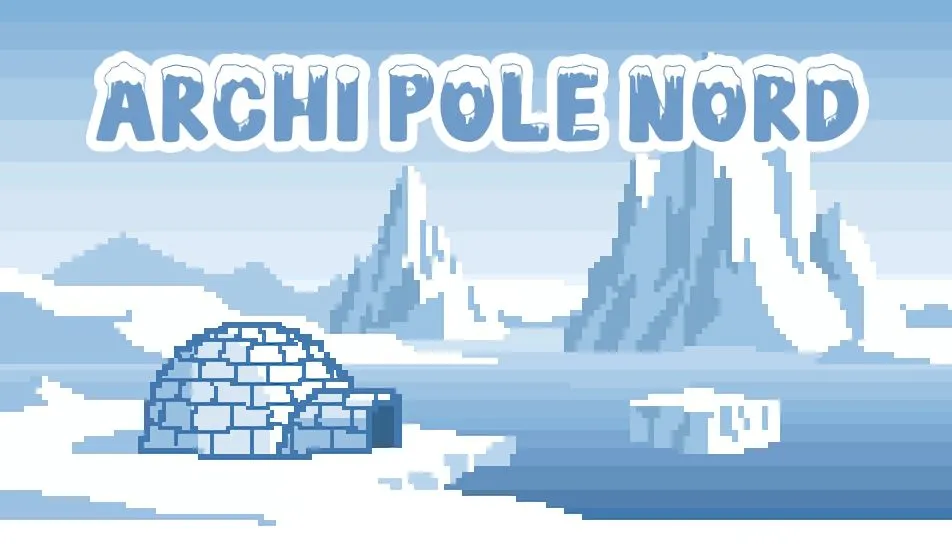

# Archi Pole Nord 

Pour notre projet T3 (2e année de BUT Informatique), nous avons développé un **jeu sérieux** intitulé **Archi North Pole**. <br>
Un **jeu sérieux en 2D** où le joueur incarne un architecte chargé de rénover la **station polaire Concordia**. Il doit concevoir des espaces adaptés à un **environnement extrême, confiné et multinational** (français et italien). <br> <br>

<p align="center">  </p>

## Technologies utilisées
- **Godot Engine 4.3**
- **GDScript**
- **PixelArt** pour les sprites et interfaces
- **GitHub/GitLab** pour la gestion de tâches et du développement collaboratif (projet en mirroir)

## Installation et exécution
1. **Cloner le dépôt**
  ```bash
  git clone https://github.com/mon-utilisateur/polar-station.git
  cd polar-station
  ```
2. **Installer Godot**
Télécharge la version stable de **Godot 4.3 ou supérieure** : <br>
Télécharger **Godot Engine**

4. **Lancer le projet**
- Ouvre le dossier archi-pole-nord/ dans Godot
- Clique sur "Play Scene" (touche F5) pour exécuter le jeu

## Fonctionnalités principales
- Cycle jour/nuit et système météorologique dynamique
- Gestion des ressources (stocks, commandes de fournitures)
- Mini-jeux de maintenance (réparation de générateur, recalibrage d’antennes, etc.)
- Prise de décision morale et stratégique influençant le scénario