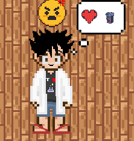

# Archi Pole Sud - Description du jeu

### [Accueil](../README.md)  
### [Installation](./INSTALL.md)

---
  
**Bienvenue jeune architecte ! Ta mission et tu ne peux que l'accepeter c'est d'agencer cette enorme station dans le pôle sud**

Archi Pole Sud est un simulateur où tu incarnes l’architecte de la station polaire Concordia, au pôle Sud. Ton objectif : transformer les espaces de vie pour améliorer le bien-être des résidents dans un environnement extrême.

Il va falloir que tu fasses preuve de considération vis à vis de leurs besoins respectifs, et comme souvent ce qui fait plaisir à l'un fera souvent raler l'autre...

**TOUS** tes choix comptent même ceux qui pourraient te paraître insignifiants

## Problématique

Comment concevoir une architecture adaptée aux milieux hostiles et confinés en intégrant l’expérience et les besoins des personnes qui y vivent et y travaillent ?

### Objectifs pédagogiques

Les objectifs pédagogiques sont de permettre au joueur de comprendre :

- **Les liens entre l'espace d'habitation et le bien-être psychologique**

  - Le moral des habitants dépend de la construction et de l'agencement des habitation.

- **Les enjeux de la conception architecturale dans les milieux extrêmes**

  - Dans un millieu hostile ou les habitants passent la plupart voire l'entièreté de leur temps en intérieur, il donc important que celui-ci soit bien aménagé.

- **Le concept de conception participative**
  - En prenant en compte l’avis des habitants, on s’assure que les choix architecturaux correspondent à leurs attentes.

### Sources et Références

- [Mémoire de Sargenti Justin](./Sargenti%20Justin%20-%20La%20notion%20de%20confort%20dans%20les%20stations%20polaires.pdf)
- [Wikipédia : Psychologie des couleurs](https://fr.wikipedia.org/wiki/Psychologie_des_couleurs)
- [KIT : Psychologie et perception architecturale](./2015_curaviva_franz.pdf)

## Déroulement d'une partie 

👴 Au lancement du jeu vous êtes accueillis par le gentil concierge barbu qui vous parle rapidement de votre mission.

☃️ Vous devez donc successivement vous occuper de l'agencement des salles en satisfaisant au mieux les exigences contradictoires des différents membres de l'équipe tout en faisant au mieux avec vos ressources limités, on est au Pôle Sud quand même !

🌡️ Chaque modification que vous faites influera sur la satisfaction individuelle des personnes dans la salle ou sur celle du groupe, faites attention.

🔒 Quand vous validez vos choix pour une salle, c'est définitif, pas moyen de revenir en arrière.

📋 À la fin de la partie, le concierge fait le bilan avec vous sur vos choix dans chaque salle, si des gens sont allés se plaindre suite à des choix peu judicieux...

## Interface

L’interface du jeu est conçue pour offrir une vue simple des pièces de la base polaire tout en guidant le joueur dans ses choix architecturaux. Elle permet de modifier les pièces, de voir les goûts des résidents, et de suivre l’impact des décisions à travers les réactions des résidents.

 &nbsp;&nbsp;&nbsp;&nbsp;&nbsp;&nbsp;&nbsp;&nbsp;&nbsp;&nbsp;

## Actions du joueur

- Clique sur une pièce pour l’afficher.
- Modifie directement l’environnement de l’étage : mobilier, couleurs, luminaires...
- Clique sur les personnages pour obtenir leurs goûts.
- Une fois satisfait, clique sur “Finaliser” pour confirmer ses travaux.
- Passe à la pièce suivante (modification impossible sur les pièces précédentes).
